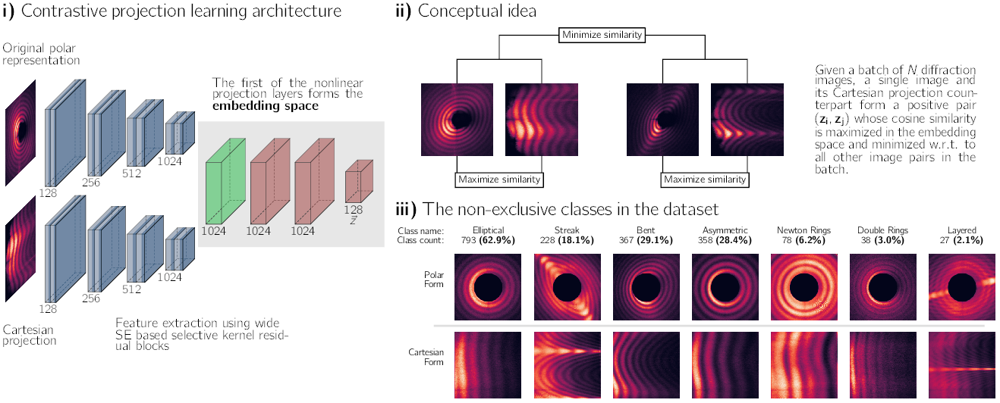

# TF2 implementation of self-supervised contrastive projection learning

This is the official implementation of the paper:

> Zimmermann, Julian; Beguet, Fabien; Guthruf, Daniel; Langbehn, Bruno and Rupp, Daniela  
> [Finding the semantic similarity in single-particle diffraction images using self-supervised contrastive projection learning](https://gitlab.ethz.ch/nux/machine-learning/contrastive_projection_learning)  


## Concept



## Abstract

> Single-shot diffraction imaging of isolated nanosized particles has seen remarkable success in recent years due to the
> growing availability of intense short-wavelength pulses, yielding in-situ measurements with ultra-high spatial and
> temporal resolution. Datasets containing millions of individual diffraction images can already be recorded, which
> represents a monumental problem as new approaches for exploring vast amounts of diffraction data have to be found. A
> semantic dimensionality reduction technique that produces meaningful embeddings for downstream tasks is critical to
> such
> approaches. Here, we present the first study of a self-supervised contrastive learning method within the diffraction
> imaging regime, where we introduce the novel concept of projection learning. A deep neural network contrasts a
> diffraction image - naturally recorded in Polar coordinates - with its Cartesian projection. We show that this
> learning
> paradigm substantially improves the embedding quality of diffraction images compared to previous methods.

## Recreate results from the paper

__[Optional] The data file will be automatically downloaded if you start the training, but if you want to build the data
on your own by already published raw data, do this:__

1) Download the published raw data file from [here](https://www.cxidb.org/id-94.html)
2) Run the script ```create_static_dataset_proj_learning.py``` from the scripts folder and make sure to adjust the paths
   that point to the cxi file and to where the output should be written.

__1. Then, you need the trained embeddings, you can get these in two ways:__

1) Train the models from scratch
    * Keep in mind that we trained on four RTX 3090 GPUs with a batch size of 628 using SE blocks and selective kernels
      enabled, so this is quite demanding. However, if you have the ressources, just run the ```./train_all.sh```
      script. This will give you the full grid search that we carried out for the paper.
2) You can also just download all the trained models
   from [here](https://share.phys.ethz.ch/~nux/datasets/contrastive_projection_learning_zimmermann_2022.tar.bz2). This
   is a bzip2 compressed tar archive of 28GB size, but you find everything in there.

__2) From there you can recreate the figures and tables by running the following scripts in the _'scripts'_ folder from
this repo:__

1) ```overlap_score_and_lin_accuracy.py```
    * This will give you the linear eval as well as the similarity overlap scores (TABLE I and II and all grid search
      results that are mentioned in the manusript).
      __These grid search results are also given here in this Readme file at the bottom.__
      For the script: Please adjust the ```data_base_path``` and the ```data_out_path``` variable in the script
      accordings
      to where you saved the models and embeddings, and where you want the results written to. For every trained model
      you get a
      micro_average PDF and pandas Dataframe PKL file, and for all models you get a macro_average PDF and pandas
      Dataframe PKL file.
2) ```similarity_plot_cplr.py```
    * The yields the CPLR part of the similarity plot (FIG. 3 __i)__) for the CLR embeddings
3) ```similarity_plot_clr.py```
    * The yields the CLR part of the similarity plot (FIG. 3 __ii)__)  for the CLR embeddings
4) ```similarity_plot_vae.py```
    * The yields the VAE part of the similarity plot (FIG. 3 __iii)__)  for the CLR embeddings

__2)__ to __4)__ are merged for figure 2 in the script using a TIKZ script, which is not available in this repository.

__Please note:__

The embeddings for the VAE and the best CLR (Polar / Cartesian with temperature of 0.1) are in the data folder, as most
scripts - except from ```overlap_score_and_lin_accuracy.py``` - only need those two embeddings.

## Hypersearch results
This is what the ```overlap_score_and_lin_accuracy.py``` script outputs:

| Type |          Mode           | NT\-Xent Temperature | F1   | Precision | Recall | Overlap |
|:----:|:-----------------------:|:--------------------:|------|:---------:|:------:|:-------:|
| CPLR |   Cartesian <-> Polar   |         0.02         | 0.30 |   0.30    |  0.32  |  0.33   |
| CLR  | Cartesian <-> Cartesian |         0.01         | 0.32 |   0.33    |  0.34  |  0.33   |
| CPLR |   Polar <-> Cartesian   |         0.02         | 0.33 |   0.34    |  0.34  |  0.36   |
| CPLR |   Cartesian <-> Polar   |         0.01         | 0.34 |   0.36    |  0.33  |  0.34   |
| CPLR |   Polar <-> Cartesian   |         0.01         | 0.35 |   0.35    |  0.35  |  0.32   |
| CLR  |     Polar <-> Polar     |         0.01         | 0.36 |   0.35    |  0.37  |  0.36   |
| CLR  | Cartesian <-> Cartesian |         0.02         | 0.39 |   0.41    |  0.37  |  0.36   |
| CLR  |     Polar <-> Polar     |         0.02         | 0.39 |   0.38    |  0.40  |  0.37   |
| CLR  | Cartesian <-> Cartesian |         0.5          | 0.43 |   0.44    |  0.43  |  0.38   |
| CLR  |     Polar <-> Polar     |         1.0          | 0.44 |   0.47    |  0.44  |  0.35   |
| CLR  | Cartesian <-> Cartesian |         0.05         | 0.44 |   0.44    |  0.45  |  0.38   |
| CLR  | Cartesian <-> Cartesian |         0.1          | 0.44 |   0.44    |  0.44  |  0.38   |
| CLR  | Cartesian <-> Cartesian |         1.0          | 0.44 |   0.45    |  0.44  |  0.37   |
| CPLR |   Polar <-> Cartesian   |         0.05         | 0.45 |   0.46    |  0.46  |  0.41   |
| CLR  |     Polar <-> Polar     |         0.5          | 0.46 |   0.49    |  0.46  |  0.37   |
| CPLR |   Polar <-> Cartesian   |         0.5          | 0.46 |   0.48    |  0.47  |  0.42   |
| CPLR |   Polar <-> Cartesian   |         1.0          | 0.46 |   0.47    |  0.46  |  0.39   |
| CLR  | Cartesian <-> Cartesian |        0.075         | 0.46 |   0.46    |  0.46  |  0.38   |
| CLR  |     Polar <-> Polar     |        0.075         | 0.47 |   0.47    |  0.48  |  0.43   |
| CLR  | Cartesian <-> Cartesian |         0.2          | 0.48 |   0.49    |  0.48  |  0.43   |
| CLR  |     Polar <-> Polar     |         0.05         | 0.48 |   0.48    |  0.48  |  0.41   |
| CPLR |   Cartesian <-> Polar   |         0.1          | 0.49 |   0.50    |  0.50  |  0.45   |
| CPLR |   Cartesian <-> Polar   |         0.05         | 0.49 |   0.50    |  0.49  |  0.42   |
| CPLR |   Cartesian <-> Polar   |         1.0          | 0.49 |   0.50    |  0.49  |  0.39   |
| CPLR |   Cartesian <-> Polar   |         0.2          | 0.49 |   0.49    |  0.50  |  0.45   |
| CLR  |     Polar <-> Polar     |         0.1          | 0.49 |   0.48    |  0.51  |  0.45   |
| CPLR |   Cartesian <-> Polar   |         0.5          | 0.49 |   0.49    |  0.49  |  0.45   |
| CLR  |     Polar <-> Polar     |         0.2          | 0.49 |   0.49    |  0.50  |  0.49   |
| CPLR |   Polar <-> Cartesian   |        0.075         | 0.50 |   0.51    |  0.50  |  0.49   |
| CPLR |   Polar <-> Cartesian   |         0.2          | 0.51 |   0.52    |  0.51  |  0.49   |
| CPLR |   Cartesian <-> Polar   |        0.075         | 0.53 |   0.51    |  0.54  |  0.52   |
| CPLR |   Polar <-> Cartesian   |         0.1          | 0.54 |   0.52    |  0.55  |  0.52   |
